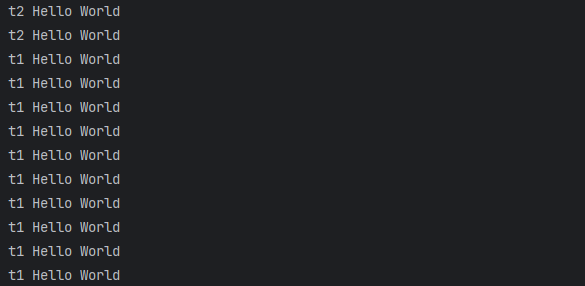
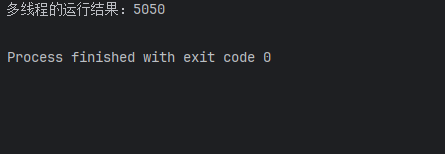
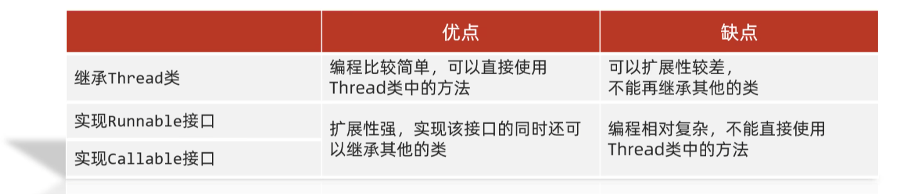
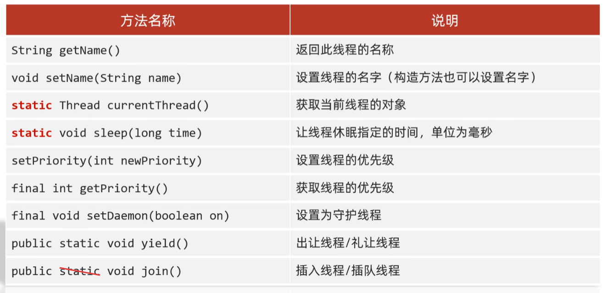

# 多线程编程


## 一、基本概念

<b style="color:red;">进程</b>：进程是程序的基本执行实体。

<b style="color:red;">线程</b>：线程是操作系统能够进行运算调度的最小单位。它被包含在<span style="color:red;">进程</span>之中，是进程中的实际运作单位。

（<span style="color:red;">简单理解</span>：线程就是应用软件中相互独立、可以同时运行的功能；当这些功能同时运行多个时，就形成了<span style="color:red;">多线程</span>）


<span style="color:darkred;">多线程的应用场景</span>

- 软件中的耗时操作：拷贝、迁移大文件；加载大量的资源文件
- 所有的聊天软件
- 所有的后台服务器

（<span style="color:blue;">只要你想让多个任务同时执行就需要用到多线程</span>）


<b style="color:red;">并发</b>：在同一时刻，有多个指令在单个CPU上<span style="color:red;">交替</span>执行

例：张三一会抽烟，一会打字，一会喝水。

<b style="color:red;">并行</b>：在同一时刻，有多个指令在单个CPU上<span style="color:red;">同时</span>执行

例：张三嘴里抽着烟的同时，手还在打字。

CPU中有内核数和线程数的概念，代表着CPU拥有多少个内核，能够同时处理多少个线程；2核4线程的CPU能够在同一时间处理最多4个线程。


## 二、多线程基础

### 多线程的实现方式

#### ①继承Thread类的方式进行实现

`MyThread`类

```java
package com.stone.case01;

public class MyThread extends Thread{

    @Override
    public void run() {
        // 线程执行代码：循环打印100次Hello World
        for (int i = 0; i < 100; i++) {
            System.out.println(getName() + " Hello World");
        }
    }
}
```

`ThreadDemo`类

```java
package com.stone.case01;

public class ThreadDemo {

    public static void main(String[] args) {
        /*
        多线程的第一种启动方式
          1.自己定义一个类继承Thread类
          2.重写run方法
          3.创建子类对象并调用start方法启动线程
         */

        MyThread myThread1 = new MyThread();
        myThread1.setName("线程1");
        myThread1.start();
        MyThread myThread2 = new MyThread();
        myThread2.setName("线程2");
        myThread2.start();
    }
}
```


#### ②实现Runnable接口的方式进行实现

`MyRun`类

```java
package com.stone.case02;

public class MyRun implements Runnable {

    @Override
    public void run() {
        // 线程执行代码：循环打印100次Hello World
        for (int i = 0; i < 100; i++) {
            // 获取当前正在执行任务的线程对象
            Thread currentThread = Thread.currentThread();
            System.out.println(currentThread.getName() + " Hello World");
        }
    }
}
```

`ThreadDemo`类

```java
package com.stone.case02;

public class ThreadDemo {

    public static void main(String[] args) {
        /*
        多线程的第二种启动方式
          1.自己定义一个类实现Runnable接口
          2.重写run方法
          3.创建Runnable接口实现类的对象
          4.创建Thread类的对象，将Runnable接口实现类的对象
            作为参数传递给Thread类的构造方法，并开启线程
         */

        // 创建MyRun对象，表示多线程要执行的任务
        MyRun myRun = new MyRun();
        // 创建线程对象
        Thread t1 = new Thread(myRun);
        Thread t2 = new Thread(myRun);
        // 设置线程名称
        t1.setName("t1");
        t2.setName("t2");
        // 开启线程
        t1.start();
        t2.start();
    }
}
```




#### ③利用Callable接口和Future接口方式实现

<span style="color:red;">相较于前两种实现方式，这种方式可以让我们获取到多线程的运行结果</span>

`MyCallable`类

```java
package com.stone.case03;

import java.util.concurrent.Callable;

public class MyCallable implements Callable<Integer> {

    @Override
    public Integer call() throws Exception {
        // 线程执行代码：求1~100的整数之和
        int sum = 0;
        for (int i = 1; i <= 100; i++) {
            sum += i;
        }
        return sum;
    }
}
```

`ThreadDemo`类

```java
package com.stone.case03;

import java.util.concurrent.ExecutionException;
import java.util.concurrent.FutureTask;

public class ThreadDemo {

    public static void main(String[] args) throws ExecutionException, InterruptedException {
        /*
        多线程的第三种实现方式：可以获取到多线程的运行结果
          1.自己定义一个类实现Callable接口
          2.重写call()方法，该方法有返回值，可以获取到多线程的运行结果
          3.创建Callable接口实现类的对象（表示多线程要执行的任务）
          4.创建FutureTask对象，将Callable接口实现类的对象作为参数传递给FutureTask的构造方法
            FutureTask类是Future接口的实现类，用来管理多线程运行的结果
          5.创建Thread对象，将FutureTask对象作为参数传递给Thread的构造方法，并启动线程
         */

        // 创建MyCallable对象，表示多线程要执行的任务
        MyCallable myCallable = new MyCallable();
        // 创建FutureTask对象，用来管理多线程运行的结果
        FutureTask<Integer> futureTask = new FutureTask<>(myCallable);
        // 创建Thread对象
        Thread t1 = new Thread(futureTask);
        // 启动线程
        t1.start();

        // 获取多线程的运行结果
        Integer result = futureTask.get();
        System.out.println("多线程的运行结果：" + result);
    }
}
```




三种实现方式对比：




### 常见的成员方法




`MyThread`类

```java
package com.stone.threadMethod;

public class MyThread extends Thread {

    public MyThread() {
    }

    public MyThread(String name) {
        super(name);
    }

    @Override
    public void run() {
        for (int i = 0; i < 100; i++) {
            // 继承了Thread类后，异常无法被抛出，只能被try-catch
            try {
                Thread.sleep(1000);
            } catch (InterruptedException e) {
                e.printStackTrace();
                // throw new RuntimeException(e);
            }
            System.out.println(getName() + " @" + i);
        }
    }
}
```

`ThreadDemo`类

```java
package com.stone.threadMethod;

public class ThreadDemo {
    /*
        String getName()：获取当前线程的名字
        void setName(String name)：设置当前线程的名字
        细节：
            1、线程的默认名称格式：Thread-X（X是序号，从0开始）
            2、除了setter方法，我们还可以通过构造方法给线程设置名称（需要在子类中通过super调用Thread父类的构造方法）

        static Thread currentThread()：获取当前线程对象
        细节：
            当JVM虚拟机启动之后，会自动的启动多条线程
            其中有一条线程就叫做main线程
            它的作用就是去调用main方法，并执行其中代码
            所以，写在main方法中的所有代码，其实都是运行在main线程中的

        static void sleep(long time)：让线程休眠指定的时间，单位为毫秒
        细节：
            1、当某条线程执行到此方法，则该线程就会在这里停止运行对应的时间
            2、方法的参数：表示线程睡眠的时间，单位是毫秒
            3、当睡眠对应的时间后，线程会自动唤醒，继续执行下面的任务代码
     */

    public static void main(String[] args) throws InterruptedException {
        // 创建线程对象
        MyThread t1 = new MyThread();
        MyThread t2 = new MyThread("线程2");
        // 开启线程
        t1.start();
        t2.start();

        // // 获取执行main方法的线程对象
        // Thread thread = Thread.currentThread();
        // System.out.println(thread.getName());
        //
        // // 让当前线程休眠5秒
        // Thread.sleep(5000);
        // System.out.println("main方法执行完毕");
    }
}
```


#### 线程优先级

线程的调度方式：**抢占式调度**（<span style="color:red;">随机性</span>）、**非抢占式调度**（轮流执行）

Java中的线程调度方式采用的是**抢占式调度**，<span style="color:red;">通过给线程设置优先级，可以增加该线程抢占CPU的成功率（优先级越大，成功率越高，但并非100%）</span>

线程的优先级一共分为10档，最小的是1，最大的是10，**线程的默认优先级是5**

`MyRunnable`类

```java
package com.stone.threadPriority;

public class MyRunnable implements Runnable {

    @Override
    public void run() {
        // 打印1~100的整数
        for (int i = 1; i <= 100; i++) {
            System.out.println(Thread.currentThread().getName() + " " + i);
        }
    }
}
```

`ThreadDemo`类

```java
package com.stone.threadPriority;

public class ThreadDemo {

    public static void main(String[] args) {
        /*
            setPriority(int newPriority) 设置线程优先级
            final int getPriority() 获取线程优先级
         */

        // 创建线程任务对象
        MyRunnable myRunnable = new MyRunnable();
        // 创建线程对象
        Thread t1 = new Thread(myRunnable, "线程1");
        Thread t2 = new Thread(myRunnable, "线程2");

        // 获取线程优先级
        System.out.println(t1.getPriority());
        System.out.println(t2.getPriority());

        // 设置线程优先级
        t1.setPriority(10);
        t2.setPriority(1);

        // 启动线程
        t1.start();
        t2.start();

        // 获取main线程的优先级：默认也是5
        // System.out.println(Thread.currentThread().getPriority());
    }
}
```


#### 守护线程

`MyThread1`类

```java
package com.stone.threadDaemon;

public class MyThread1 extends Thread{

    @Override
    public void run() {
        // 循环打印1~10的整数
        for (int i = 1; i <= 10; i++) {
            System.out.println(getName() + " @ " + i);
        }
    }
}
```

`MyThread2`类

```java
package com.stone.threadDaemon;

public class MyThread2 extends Thread {

    @Override
    public void run() {
        // 循环打印1~100的整数
        for (int i = 1; i <= 100; i++) {
            System.out.println(getName() + " @ " + i);
        }
    }
}
```

`ThreadDemo`类

```java
package com.stone.threadDaemon;

public class ThreadDemo {

    public static void main(String[] args) {
        /*
            final void setDaemon(boolean on)：将此线程标记为守护线程或用户线程。
            细节：
                当其他的非守护线程执行完毕之后，守护线程会陆续结束
            白话：当女神线程结束了，那么备胎线程也没有存在的必要了
         */
        MyThread1 t1 = new MyThread1();
        MyThread2 t2 = new MyThread2();
        t1.setName("女神");
        t2.setName("备胎");

        // 设置守护线程
        t2.setDaemon(true);

        t1.start();
        t2.start();
    }
}
```

**守护线程的应用场景**：聊天时传输文件，聊天窗口可以视为非守护线程，传输文件可以视为守护线程，当聊天窗口被关闭，文件传输自然也就随之停止；


#### 出让线程

`MyThread`类

```java
package com.stone.threadYield;

public class MyThread extends Thread {

    @Override
    public void run() {
        // 循环打印1~100的整数
        for (int i = 1; i <= 100; i++) {
            System.out.println(getName() + " @ " + i);
            // 表示出让当前CPU的执行权
            Thread.yield();
        }
    }
}
```

`ThreadDemo`类

```java
package com.stone.threadYield;

public class ThreadDemo {

    public static void main(String[] args) {
        /*
            public static void yield()：出让线程/礼让线程；暂停当前正在执行的线程对象，并执行其他线程。
         */
        MyThread t1 = new MyThread();
        MyThread t2 = new MyThread();
        t1.setName("线程1");
        t2.setName("线程2");
        t1.start();
        t2.start();
    }
}
```


#### 插入线程

`MyThread`类

```java
package com.stone.threadJoin;

public class MyThread extends Thread {

    @Override
    public void run() {
        // 循环打印1~100的整数
        for (int i = 1; i <= 100; i++) {
            System.out.println(getName() + " @ " + i);
        }
    }
}
```

`ThreadDemo`类

```java
package com.stone.threadJoin;

public class ThreadDemo {

    public static void main(String[] args) throws InterruptedException {
        /*
            public final void join()：插入线程/插队线程；等待线程终止；等待调用join方法的线程执行结束。
         */
        MyThread myThread = new MyThread();
        myThread.setName("土豆");
        myThread.start();

        // 将myThread线程插入到当前线程（这里是main线程）之前运行
        myThread.join();

        for (int i = 0; i < 10; i++) {
            System.out.println("main线程 " + i);
        }
    }
}
```


### 线程的生命周期

https://www.bilibili.com/video/BV1LG4y1T7n2?spm_id_from=333.788.player.switch&vd_source=71b23ebd2cd9db8c137e17cdd381c618&p=11